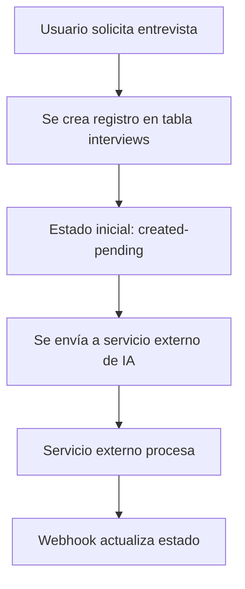
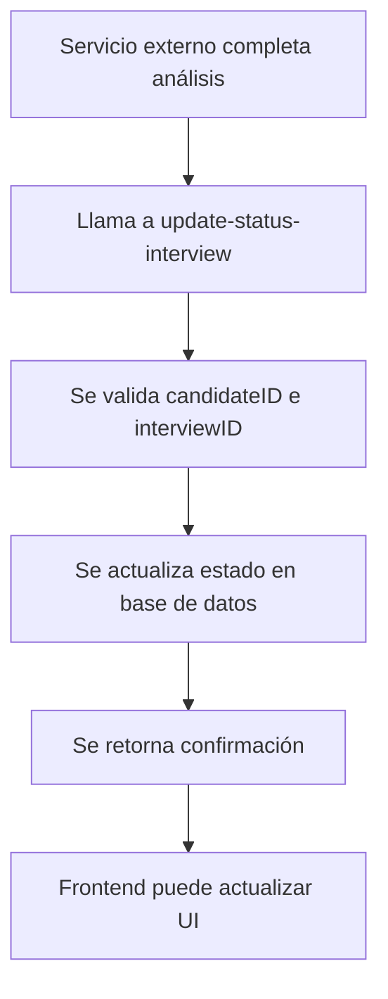

# Integración de update-status-interview

Este documento explica cómo integrar la función `update-status-interview` con el resto del sistema de Academy by LaPieza.

## Flujo de Trabajo

### 1. Creación de Entrevista



### 2. Actualización de Estado



## Estados de Entrevista

| Estado                | Descripción                                   | Siguiente Estado Posible |
| --------------------- | --------------------------------------------- | ------------------------ |
| `created-pending`     | Entrevista creada, pendiente de procesamiento | `analyzing-interview`    |
| `analyzing-interview` | Entrevista siendo analizada por IA            | `completed`, `failed`    |
| `completed`           | Análisis completado exitosamente              | -                        |
| `failed`              | Error en el análisis                          | -                        |

## Uso en el Frontend

### React Hook para Actualizar Estado

```typescript
import { useState } from "react";

interface UpdateStatusParams {
  candidateID: string;
  status: string;
  interviewID: string;
}

export const useUpdateInterviewStatus = () => {
  const [isLoading, setIsLoading] = useState(false);
  const [error, setError] = useState<string | null>(null);

  const updateStatus = async (params: UpdateStatusParams) => {
    setIsLoading(true);
    setError(null);

    try {
      const response = await fetch("/functions/v1/update-status-interview", {
        method: "POST",
        headers: {
          "Content-Type": "application/json",
          Authorization: `Bearer ${process.env.NEXT_PUBLIC_SUPABASE_ANON_KEY}`,
        },
        body: JSON.stringify(params),
      });

      const data = await response.json();

      if (!response.ok) {
        throw new Error(data.error || "Error updating interview status");
      }

      return data;
    } catch (err) {
      setError(err instanceof Error ? err.message : "Unknown error");
      throw err;
    } finally {
      setIsLoading(false);
    }
  };

  return { updateStatus, isLoading, error };
};
```

### Componente de Uso

```typescript
import { useUpdateInterviewStatus } from "./hooks/useUpdateInterviewStatus";

const InterviewStatusUpdater = ({ interview }) => {
  const { updateStatus, isLoading, error } = useUpdateInterviewStatus();

  const handleStatusUpdate = async (newStatus: string) => {
    try {
      await updateStatus({
        candidateID: interview.candidate_id,
        status: newStatus,
        interviewID: interview.interview_id,
      });

      // Actualizar UI o mostrar notificación
      toast.success("Estado de entrevista actualizado");
    } catch (err) {
      toast.error("Error al actualizar estado");
    }
  };

  return (
    <div>
      <button
        onClick={() => handleStatusUpdate("analyzing-interview")}
        disabled={isLoading}
      >
        {isLoading ? "Actualizando..." : "Marcar como Analizando"}
      </button>

      {error && <p className="text-red-500">{error}</p>}
    </div>
  );
};
```

## Integración con Webhooks Externos

### Ejemplo de Webhook de Servicio de IA

```typescript
// En tu servicio externo de IA
app.post("/interview-completed", async (req, res) => {
  const { candidateID, interviewID, analysisResult } = req.body;

  try {
    // Actualizar estado en Supabase
    const response = await fetch(
      `${process.env.SUPABASE_URL}/functions/v1/update-status-interview`,
      {
        method: "POST",
        headers: {
          "Content-Type": "application/json",
          Authorization: `Bearer ${process.env.SUPABASE_SERVICE_ROLE_KEY}`,
        },
        body: JSON.stringify({
          candidateID,
          status: "completed",
          interviewID,
        }),
      }
    );

    if (!response.ok) {
      throw new Error("Failed to update interview status");
    }

    // Continuar con el procesamiento
    res.json({ success: true });
  } catch (error) {
    console.error("Error updating interview status:", error);
    res.status(500).json({ error: "Internal server error" });
  }
});
```

## Monitoreo y Logs

### Logs de la Función

La función registra logs detallados que puedes monitorear en Supabase:

```bash
# Ver logs en tiempo real
supabase functions logs update-status-interview --follow

# Ver logs de una función específica
supabase functions logs update-status-interview
```

### Métricas Importantes

- **Tiempo de respuesta**: Debe ser < 1 segundo
- **Tasa de éxito**: Debe ser > 99%
- **Errores comunes**: Validación de campos, candidato no encontrado

## Testing

### Pruebas Unitarias

```typescript
// test/update-status-interview.test.ts
describe("update-status-interview", () => {
  it("should update interview status successfully", async () => {
    const response = await fetch("/functions/v1/update-status-interview", {
      method: "POST",
      headers: { "Content-Type": "application/json" },
      body: JSON.stringify({
        candidateID: "test-candidate",
        status: "analyzing-interview",
        interviewID: "test-interview",
      }),
    });

    expect(response.status).toBe(200);
    const data = await response.json();
    expect(data.success).toBe(true);
  });

  it("should reject invalid status", async () => {
    const response = await fetch("/functions/v1/update-status-interview", {
      method: "POST",
      headers: { "Content-Type": "application/json" },
      body: JSON.stringify({
        candidateID: "test-candidate",
        status: "invalid-status",
        interviewID: "test-interview",
      }),
    });

    expect(response.status).toBe(400);
  });
});
```

### Pruebas de Integración

```bash
# Usar el script de prueba incluido
./test-function.sh -c candidate_123 -s analyzing-interview -i interview_456

# O usar curl directamente
curl -X POST "https://your-project.supabase.co/functions/v1/update-status-interview" \
  -H "Content-Type: application/json" \
  -H "Authorization: Bearer YOUR_ANON_KEY" \
  -d '{
    "candidateID": "candidate_123",
    "status": "analyzing-interview",
    "interviewID": "interview_456"
  }'
```

## Seguridad

### Validaciones Implementadas

1. **Campos requeridos**: Se validan todos los campos obligatorios
2. **Estados válidos**: Solo se aceptan estados predefinidos
3. **Verificación de candidato**: Se confirma que el candidateID coincida
4. **Sanitización**: Se valida el formato JSON y se escapan caracteres especiales

### Permisos de Base de Datos

Asegúrate de que la función tenga los permisos necesarios en Supabase:

```sql
-- Dar permisos a la función para actualizar la tabla interviews
GRANT UPDATE ON interviews TO authenticated;
GRANT SELECT ON interviews TO authenticated;
```

## Troubleshooting

### Errores Comunes

1. **"Interview not found"**: Verificar que el interviewID sea correcto
2. **"Candidate ID mismatch"**: Confirmar que el candidateID coincida con el almacenado
3. **"Invalid status"**: Usar solo los estados válidos definidos

### Debugging

```typescript
// Agregar logs adicionales en el frontend
console.log("Updating interview status:", {
  candidateID,
  status,
  interviewID,
});

// Verificar respuesta completa
const response = await fetch("/functions/v1/update-status-interview", {
  method: "POST",
  headers: { "Content-Type": "application/json" },
  body: JSON.stringify(params),
});

console.log("Response status:", response.status);
console.log("Response headers:", response.headers);
const data = await response.json();
console.log("Response data:", data);
```
